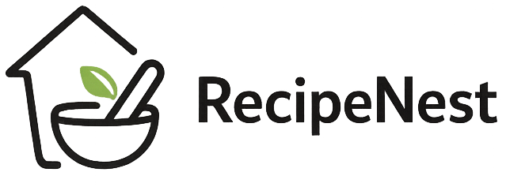

<p align="center">
  
</p>
<p align="center">


</p>

# RecipeNest

RecipeNest is a modern single-page recipe application built with Vanilla JavaScript following the Model–View–Controller (MVC) architectural pattern. It allows users to search for recipes, view detailed cooking instructions, bookmark their favourite recipes, and upload their own creations.

This project was developed as an evolution of the Forkify application from Jonas Schmedtmann's JavaScript course. While inspired by the original project and API, RecipeNest features a redesigned user interface, an improved user experience, responsive layouts, and additional functionality.

---

## Live Demo

👉

---

## Features

- Search recipes from the Forkify API
- View complete recipe details
- Bookmark favourite recipes
- Persistent bookmarks using Local Storage
- Upload custom recipes
- Responsive layout for desktop, tablet and mobile devices
- Skeleton loading states
- Client-side pagination

---

## Technologies

- JavaScript (ES6+)
- HTML5
- SCSS
- Parcel
- MVC Architecture
- Local Storage
- Forkify API

---

## Project Structure

```
src/
├── js/
│   ├── controller.js
│   ├── model.js
│   ├── helper.js
│   ├── config.js
│   └── views/
├── sass/
├── img/
└── index.html
```

The application follows the Model–View–Controller (MVC) pattern:

- **Model** manages the application state and API communication.
- **Views** are responsible for rendering and updating the user interface.
- **Controller** coordinates the interaction between the model and the views.

---

## Installation

Clone the repository:

```bash
git clone https://github.com/RicardoMartins07/recipe-nest.git
```

Install dependencies:

```bash
npm install
```

Run the development server:

```bash
npm start
```

Create a production build:

```bash
npm run build
```

---

## Functionality

### Recipe Search

Users can search recipes using keywords. Results are displayed with pagination.

### Recipe Details

Selecting a recipe displays complete cooking information, including ingredients, preparation details and publisher information.

### Bookmarks

Recipes can be bookmarked and are persisted locally using the browser's Local Storage.

### Upload Recipes

Users can create their own recipes through the upload form. Newly created recipes are automatically added to the bookmarks list.

---

## Learning Objectives

This project was developed to strengthen practical knowledge of:

- Modern JavaScript (ES6+)
- Asynchronous programming
- API integration
- MVC architecture
- State management
- Component-based UI organisation
- DOM rendering strategies
- Responsive interface development

---

## License

This project is intended for educational and portfolio purposes.
